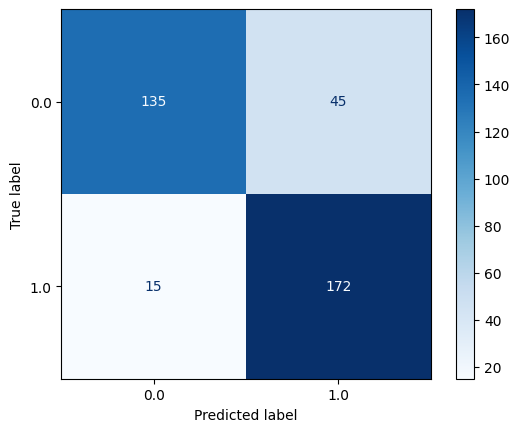
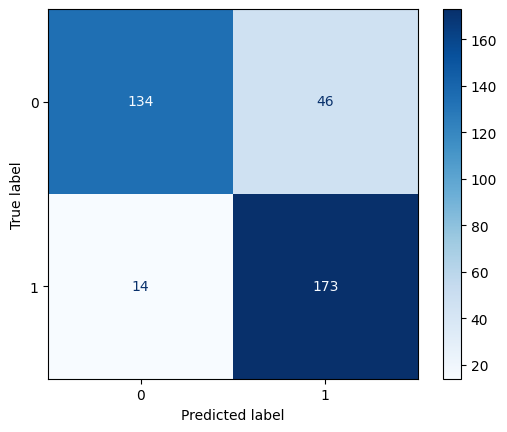
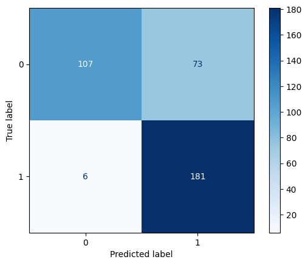
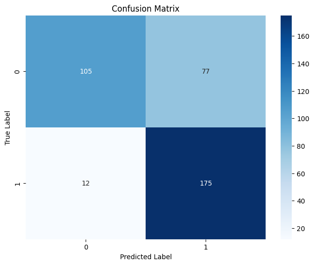
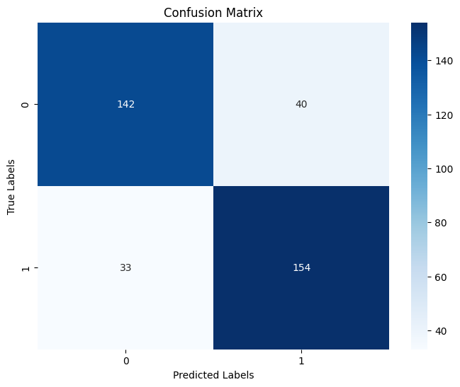
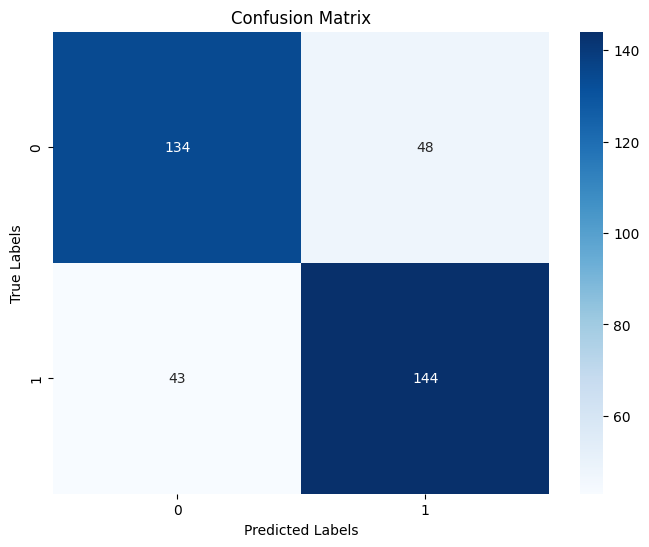
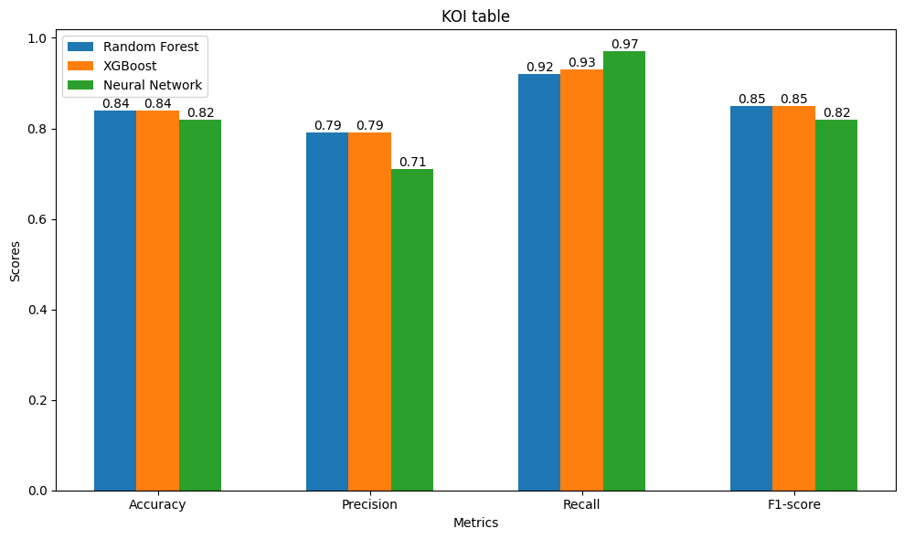
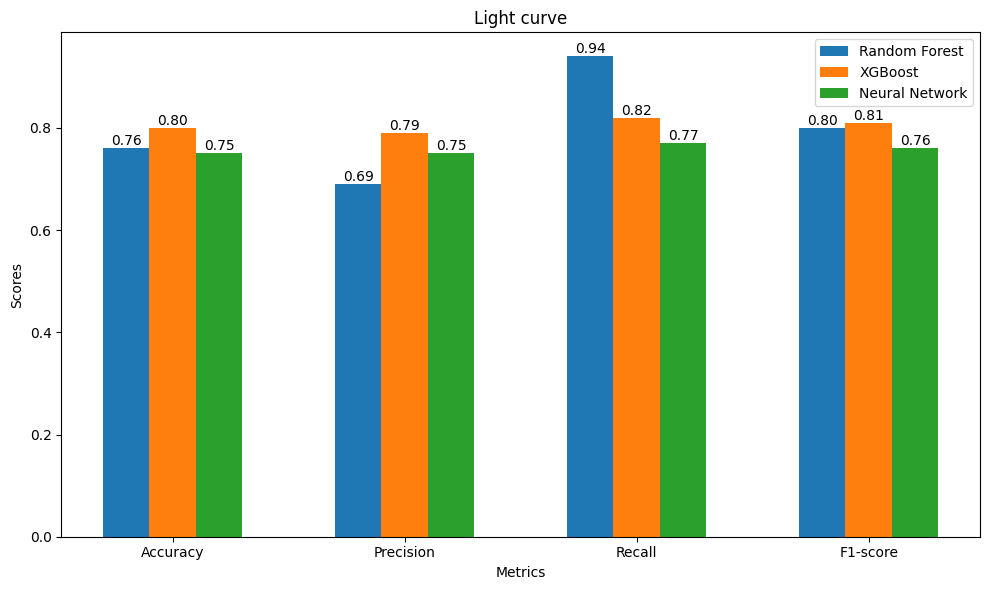

# **KOI Table Group**
## **Random Forest**
1. Accuracy : 0.84
2. Precision : 0.79
3. Recall : 0.92
4. F1-score : 0.85
- 5 most importance features
    1. koi_impact
    2. koi_depth
    3. koi_model_snr
    4. koi_steff
    5. koi_smet
- CM

## **XGBoost**
1. Accuracy : 0.84
2. Precision : 0.79
3. Recall : 0.93
4. F1-score : 0.85
- 5 most importance features
    1. koi_impact
    2. koi_insol
    3. koi_depth
    4. koi_model_snr
    5. koi_teq
- CM

## **Neural Network**
1. Accuracy : 0.82
2. Precision : 0.71
3. Recall : 0.97
4. F1-score : 0.82
- CM

# **Light Curve Group**
## **Random Forest**
1. Accuracy : 0.76
2. Precision : 0.69
3. Recall : 0.94
4. F1-score : 0.80
- 5 most importance features
    1. light_curve__fft_coefficient__attr_"abs"__coeff_4
    2. light_curve__standard_deviation
    3. light_curve__mean_n_absolute_max__number_of_maxima_7
    4. light_curve__permutation_entropy__dimension_3__tau_1
    5. light_curve__quantile__q_0.1
- CM

## **XGBoost**
1. Accuracy : 0.80
2. Precision : 0.79
3. Recall : 0.82
4. F1-score : 0.81
- 5 most importance features
    1. light_curve__fft_coefficient__attr_"abs"__coeff_4
    2. light_curve__sum_values
    3. light_curve__ar_coefficient__coeff_2__k_10
    4. light_curve__augmented_dickey_fuller__attr_"usedlag"__autolag_"AIC"
    5. light_curve__ratio_beyond_r_sigma__r_3
- CM

## **Neural Network**
1. Accuracy : 0.75
2. Precision : 0.75
3. Recall : 0.77
4. F1-score : 0.76
- CM

# **Comparing**
1. KOI table group

2. Light curve group

